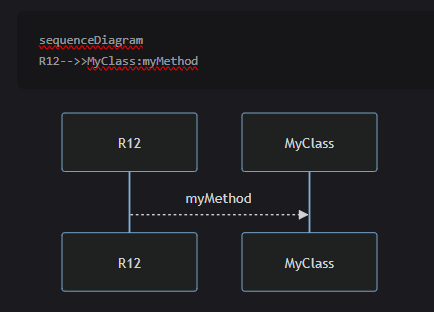

# ts2uml

This is a project that converts TypeScript to UML.

## Description

This project, ts2uml, is designed to convert TypeScript code into UML diagrams. It's currently at version 0.0.1.

### To use the sequence decorator in your TypeScript classes, follow these steps:

1. Import the sequence decorator from the src/sequence.ts file:

```
    import { sequence, setSequenceId, getSequence } from './sequence';
```

2. Apply the sequence decorator to your class methods:

```

/**
* class declaration annotated
class MyClass {
    @sequence()
    public myMethod() {
        // Method implementation
    }
}

// start the sequence by setting the request id for workflow
setSequenceId("R12"); // can be random, unique and retrievable

// Start of the sequence
let l1=new MyClass();
l1.myMethod();

// End of the sequence

getSequence("R12");

/**
* getSequence returns the text uml
*
* output will be like
* sequenceDiagram
* R12->MyClass:myMethod
*
*/

```



3. The sequence decorator will modify the original method to apply a graph sequence. It creates a new GraphNode if one does not already exist for the requestId, applies the graph sequence, and handles any errors that occur during the execution of the original method.

## setSequenceId

setSequenceId is a function used to assign a unique identifier (the sequence ID, which is the same as the request ID in this case) to each request. This is done for tracking, logging, or handling each request in your sequence diagram.

### RequestId in AWS

In AWS, the RequestId is a unique identifier assigned to each request that the service receives. This ID is used to track the request through the system and to identify the request in logs and other diagnostic information. In the context of the sequence diagram, the sequence ID is similar to the RequestId in AWS, as it is used to identify and track each request through the system.

### Use RequestId as SequenceId in AWS context

The request ID can be assigned to the sequence ID and can be used in the AWS context to track and identify each request in a sequence diagram. You can easily identify and track the flow of requests through the sequence diagram. This can be useful for debugging, monitoring, and analyzing the performance of your system.
